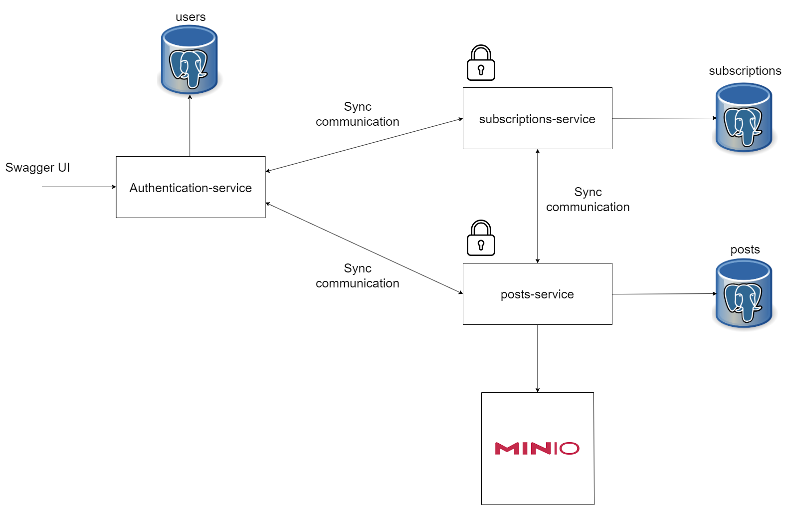

# Restful API Социальной медиа платформы
Целью проекта ставится разработка REST API, позволяющего пользователям регестрироваться, входить в систему, создавать посты, переписываться,
подписываться на других пользователей и получать свою ленту активности.

# Архитектура приложения

# Authentication-service
Authentication-service ответственнен за регистрацию и аутентификацию пользователей.
Предусмотрена валидация для этих операций. После того, как пользователь проходит аутентификацию, ему выдается JWT токен, который используется для взаимодействия с двумя другими
микросервисами. Следует отметить, что оставшиеся два микровервиса содержат внутри себя 
валидатор токена, что позволяет отклонять запросы с неправильными токенами.

# Posts-service
Posts-service ответственнен за операции с постами: создание, редактирование, получение, удаление
постов. Конечно, для каждой операции предусмотрены проверки: так, у Вас не получится удалить
пост, который создал кто-то другой. Каждый пост представляет из себя JSON, который содержит
заголовок поста(title), текст-содержимое(content), время создания и картинки(images). Каждый пост хранит информацию
о том, кто его создал, а с помощью связи many-to-many реализуется связь между таблицами, одна из которых
хранит информацию о постах, а другая - ссылки на изображения. Сами изображения хранятся в файловом
хранилище Minio, которое польностью совместимо с AMAZON S3.

# Subscriptions-service
Subscriptions-service ответственнен за логику взаимодействия пользователей.
Пользователь может посмотреть список всех пользователей в системе, подписаться 
на любого из них, отписаться от любого, на кого подсписан. Все подписки хранятся,
и пользователь в любой момент может посмотреть все новые посты от всех, на 
кого он подписан. Кроме подписок, пользователь может отправить заявку в друзья
другому пользователю, а тот, в свою очередь, может либо принять ее, либо отклонить.
В случае отправки заявки в друзья автоматически происходит подписка. Пользователь может
создать чат с другом(чат не реализовывался). Последние посты по подписке можно получать так же
с пагинацией и сортировкой по времени создания. 

# Запуск приложения
Для запуска Вам необходимо выполнить несколько этапов:
1. Скачать zip архив с проектом. После откройте проект в Intellij Idea Ultimate.
2. Открыть файл docker-compose в меню проекта. Запустить оба контейнера. Перейти в браузере по адресу http://localhost:9000, логин и пароль
minioadmin после создать бакет images
3. Если на каком либо из следующих сервисов приложение будет говорить, что порт занят - поменяйте в application.properties и config/OpenApiConfig соответсвующего сервиса порт на любой другой
4. В правой вкладке Intellij откройте Database и создайте внутри app@localhost еще две базы данных: subscriptions и posts
5. Запустите микросервис Authentication-service
6. Запустите микросервис Posts-service
7. Запустите микросервис Subscriptions-service
8. Для взаимодействия с приложением требуется открыть три ссылки на swagger UI,каждая на свой микросервис:

http://localhost:8080/swagger-ui/index.html#

http://localhost:8085/swagger-ui/index.html#

http://localhost:8090/swagger-ui/index.html#
В первом приложении Вы получаете токен, который потом используете при каждом запросе вне authentication-service(в нем токен вставлять не нужно).
Токен вставляется в кнопке Authorize. Таким образом, взаимодействие с приложением производится через три окна, в каждом из которых своя логика.
